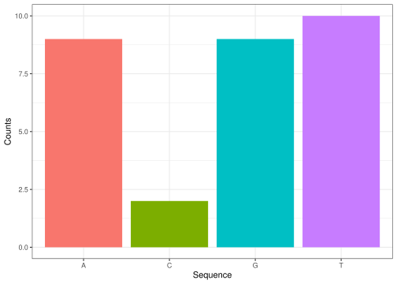
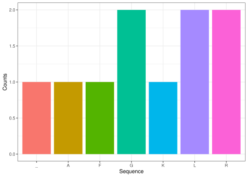
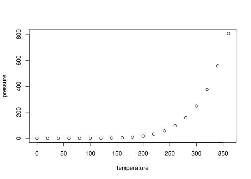

title: “dogmaR” output: rmarkdown::pdf_document vignette: \> % % % —

<https://github.com/rforbiodatascience24/group_01_package>

dogmaR is a an R package for dealing with biological sequences and their
common transformations in the context of the central dogma of molecular
biology. That is the processes replicating DNA, transcribing it into RNA
and translating it into amino acids

# Making DNA

Often you, the user, would have a particular sequence of interest but in
case you do not, dogmaR can generate a random one for you using the
make_DNA command. To use it you simply specify the number of bases you
would like as as shown in the example below:

``` r
library(dogmaR)
make_DNA(12)
#> [1] "GATTCGCCCCGA"
```

# Transcribing RNA

The first step of converting the genetic information stored in DNA into
molecules that act is transcribing the DNA into RNA. To simulate this
process, where thymidin is replaced by uracil in the sequence you can
use the dna_to_rna function as shown in the example below:

``` r
dna_to_rna("ATCCAATCCACT")
#> [1] "AUCCAAUCCACU"
```

# Translating RNA to Proteins

To translate an RNA sequence into a a peptide sequence, the list of
codons must first be identified, which can be done using the get_codons
function, as described below:

``` r
# transcribe in reading frame 1
get_codons("AUCCAAUCCACU",start=1)
#> [1] "AUC" "CAA" "UCC" "ACU"

# transcribe in reading frame 2
get_codons("AUCCAAUCCACU",start=2)
#> [1] "UCC" "AAU" "CCA"

#transcribe in reading frame 3
get_codons("AUCCAAUCCACU",start=3)
#> [1] "CCA" "AUC" "CAC"
```

This list of codons can then be translated into a peptide sequence using
the get_aa_from_codons function, as illustrated in the example below:

``` r
# transcribe in reading frame 1

# get a vector of codons from a sequence using the get_codons function
codon_vector <- get_codons("AUCCAAUCCACU",start=1)

# translate the codons
get_aa_from_codon(codon_vector)
#> [1] "IQST"
```

A combination of the previous these functions can thus be used to
illustrate all steps of the central dogma of molecular biology

``` r
DNA <- make_DNA(15)
RNA <- dna_to_rna(DNA)
codons <- get_codons(RNA)
aa_seq <- get_aa_from_codon(codons)

codon_str <- paste(codons,collapse=" ")     
paste0("The DNA sequence ", DNA, " is transcribed into ",RNA," which contains the following codons ",codon_str," which are translated into the following amino acid sequence ",aa_seq)
#> [1] "The DNA sequence GGCCGATGGAACACA is transcribed into GGCCGAUGGAACACA which contains the following codons GGC CGA UGG AAC ACA which are translated into the following amino acid sequence GRWNT"
```

# Visualizing sequence compositions

If you are interested in visualizing the sequence composition of
whatever sequence you are working with, DNA, RNA or amino acid the
function plot_seq_composition can help you:

``` r
DNA <- make_DNA(30)
RNA <- dna_to_rna(DNA)
codons <- get_codons(RNA)
aa_seq <- get_aa_from_codon(codons)


plot_seq_composition(DNA)
```

<!-- -->

``` r

plot_seq_composition(aa_seq)
```

<!-- -->

<!-- README.md is generated from README.Rmd. Please edit that file -->

# dogmaR

<!-- badges: start -->
<!-- badges: end -->

The goal of dogmaR is to …

## Installation

You can install the development version of dogmaR from
[GitHub](https://github.com/) with:

``` r
# install.packages("devtools")
devtools::install_github("rforbiodatascience24/group_01_package")
```

## Example

This is a basic example which shows you how to solve a common problem:

``` r
library(dogmaR)
## basic example code
```

What is special about using `README.Rmd` instead of just `README.md`?
You can include R chunks like so:

``` r
summary(cars)
#>      speed           dist       
#>  Min.   : 4.0   Min.   :  2.00  
#>  1st Qu.:12.0   1st Qu.: 26.00  
#>  Median :15.0   Median : 36.00  
#>  Mean   :15.4   Mean   : 42.98  
#>  3rd Qu.:19.0   3rd Qu.: 56.00  
#>  Max.   :25.0   Max.   :120.00
```

You’ll still need to render `README.Rmd` regularly, to keep `README.md`
up-to-date. `devtools::build_readme()` is handy for this.

You can also embed plots, for example:



In that case, don’t forget to commit and push the resulting figure
files, so they display on GitHub and CRAN.
